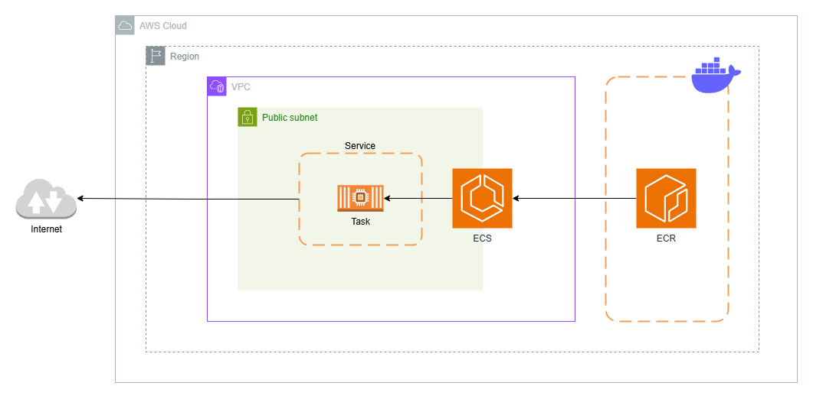
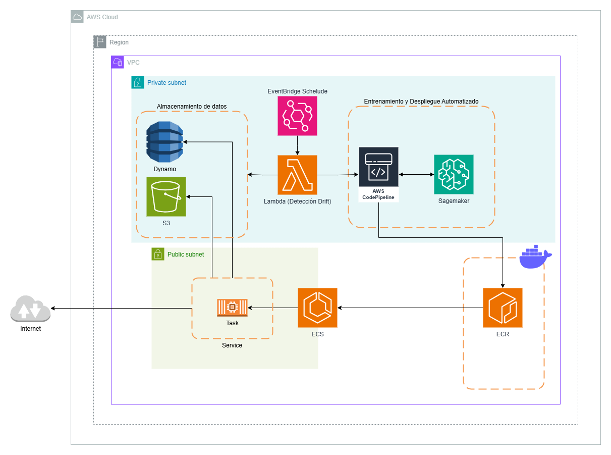

# Predicción de Dígitos
Esta aplicación implementa un modelo de inteligencia artificial diseñado para reconocer e identificar dígitos a partir de imágenes. Utiliza técnicas avanzadas de procesamiento de imágenes y aprendizaje automático para realizar predicciones precisas, convirtiendo imágenes de dígitos escritos a mano en su representación numérica correspondiente.

# Estructura del proyecto
El siguiente diagrama describe la estructura actual del proyecto **Predicción de Dígitos**

``` text
.
├── digits_model/
│   ├── digits_model/
│   │   ├── urls.py
│   │   └── ...
│   ├── model/
│   │   └── clf.pickle
│   ├── predicciones/
│   │   ├── apps.py
│   │   └── views.py
│   ├── templates/
│   │   └── index.html
│   └── manage.py
├── test/
│   ├── digit_42.jpg
│   └── ...
├── .gitignore
├── app.py
├── data_generator.ipynb
├── docker-compose.yml
├── dockerfile
├── README.md
└── requirements.txt
```
* `digits_model/`: en este directorio se encuentra contenida la aplicación **backend (REST API)** encargada de **servir el modelo**. Dicho servicio se encuentra desarrollado en el **framework Django**.
  * `digits_model/digits_model/`: en este directorio se encuentra las configuraciones que requiere Django para servir la aplicación como los **settings**, **urls** y **el Web Server Gateway Interface (WSGI)**
  * `digits_model/model/`: en este directorio se encuentra el **modelo clf.pickle** encargado de inferir el dígito representando en una imagen.
  * `digits_model/predicciones/`: este directorio representa la aplicación (app) del proyecto **digits_model**, acá se encuentra definidas las vistas para cada una de las direcciones que posee la aplicación referente a la predicción/inferencia del modelo.
  * `digits_model/templates`: en este directorio se encuentran los archivos `.html` que se renderizan en el cliente.  Una plantilla contiene las partes estáticas de la salida HTML.
  * `digits_model/manage.py`: representa el script de administración de Django con él, podemos realizar acciones como: ejecutar el servidor, realizar migraciones, migraciones de modelo, etc.
* `test/` y `data_generator.ipynb`: este directorio contiene una serie de imágenes para ser utilizadas como test de la aplicación. Dichas imágenes son generedas de manera aleatoria a la hora de ejecutar `data_generator.ipynb`.
* `.gitignore`: archivos ignorados por **git**.
* `app.py`: contiene un pequeño script donde se ilustra cómo importar y ejecutar el modelo **clf.pickle**.
* `docker-compose.yml`: contiene las instrucciones necesarias para ejecutar un contenedor a partir de la imagen Docker de la aplicación.
* `dockerfile`: contiene las instrucciones para crear una imagen de la aplicación.
* `README.md`: contiene la documentación de este proyecto.
* `requirements.txt`: contiene todas las dependencias necesarias para la ejecutar la aplicación.

# Ejecución
A continuación se indica como ejecutar la aplicación de menera local sin usar Docker y de manera local usando Docker.
## Ejecución Local (No Docker)

Para ejecutar la aplicación de manera local **por primera vez** ejecutar los siguientes comandos:
> ⚠️ ***Es importante tener en cuenta que:***
> 
>   1. ***Versión de Python:** 3.11.7*
>   2. *A la hora de ejecutar los comandos que se muestran a continuación asegúrese de que se encuentre ubicado, en consola, en el directorio del proyecto.*

1. **Creación del ambiente virtual**:
    ``` bash
    python -m venv .venv 
    ```
2. **Activación del ambiente virtual**: 
    ```bash
    source .venv/Scripts/activate
    ```
3. **Instalación de dependencias**:
    ```bash
    pip install -r requirements.txt
    ```

5. **Ejecutar la aplicación**:
   
    ```bash
    python manage.py runserver
    ```
    > ⚠️ *A la hora de ejecutar la aplicación es importante tener en cuenta que debemos estar ubicados, en consola, en la carpeta **`cd digits_model`***

Si no es la primera vez que ejecutas esta aplicación y previamente ya has realizado los pasos anteriores, solo debes de ejecutar los pasos **2. Activación del ambiente virtual** y **4. Ejecutar la aplicación** de los mencionados anteriormente

## Ejecución Local (Docker)
Para ejecutar la aplicación en Docker de manera local asegúrese en primera instancia de tener instalado Docker y luego ejecute los siguientes comandos:

> ⚠️ ***Es importante tener en cuenta que:** A la hora de ejecutar los comandos que se muestran a continuación asegúrese de que se encuentre ubicado, en consola, en el directorio del proyecto.*

1. **Creación de la imagen virtual:**
   ```docker
   docker build --tag corona-model:v0 .
   ```
2. **Ejecución del contenedor:**
    ```docker
    docker compose up
    ```
Si no es la primera vez que ejecutas la aplicación de manera local usando Docker y ya posees una imagen virtual (imagen del paso **1 .Creación de la imagen virtual**) puedes ejecutar directamente el paso  **2. Ejecución del contenedor**.

---
# 📑 REST API Documentation
## Instroducción
Esta API proporciona un único punto de acceso para hacer predicciones basadas en una imagen de entrada y un modelo de aprendizaje automático especificado. La API acepta una solicitud POST con un formulario que contiene un archivo de imagen y el nombre del modelo, y devuelve el resultado de la predicción.

### Base URL
* **[DEV - Docker]**: http://localhost:80/
* **[DEV - No Docker]**: http://localhost:8000/
* **[PROD]**: http://44.201.153.114:8000/

> ⚠️ ***Es importante tener en cuenta que:** para usar la Base URL de desarrollo debemos de tener en ejecución la aplicación en la máquina local, ya sea en un contenedor o no.*

## Endpoints

### POST `{{Base URL}}/predict/`
Este endpoint acepta un archivo de imagen y un nombre de modelo, y devuelve una predicción basada en el modelo proporcionado.

**Request**.
* **Method**: POST
* **Endpoint**: /predict/
* **Content-Type**: multipart/form-data

**Parámetros**.

El cuerpo (**body**) de la solicitud debe contener los siguientes dos parámetros como **form-data**.

| **Parámetro** | **Tipo** | **Requerido** | **Descripción**                                           |
| ------------- | -------- | ------------- | --------------------------------------------------------- |
| **image**     | file     | Sí            | Imagen que será usada para la inferencia.                 |
| **model**     | string   | Sí            | Nombre del modelo de Machine Learning usado para inferir. |

**Ejemplo request**
```bash
curl -X POST {{Base URL}}/predict/ \
  -F 'image=@/path/to/your/image.jpg' \
  -F 'model=clf.pickle'

> {
    "status_code": 200,
    "query_id": "70cd7b2a-dd66-4fce-b13a-cede33c80422",
    "prediction": 2,
    "execution_time": "2.08 seg"
}
```
donde:
| **Campo**          | **Tipo** | **Descripción**                                                             |
| ------------------ | -------- | --------------------------------------------------------------------------- |
| **success**        | int      | 200 para indicar que la petición fue exitosa.                               |
| **query_id**       | string   | uuid que identifica de manera única la petición.                            |
| **prediction**     | int      | Predicción del modelo basado en la imagen.                                  |
| **execution_time** | string   | Tiempo que le toma al modelo en realizar una predicción medida en segundos. |
| **error**          | string   | Mensaje de error si la consulta falla (opcional)                            |

# Arquitectura en Producción

A continuación se muestra la arquitectura empleada en AWS que sirve al modelo actualmente. 

> *Recordar que la aplicación se encuentra desplegada en http://44.201.153.114:8000/*



---
# Estrategia para la detección de Drift

Para abordar el problema del **drift** en datos en un sistema de machine learning en producción, se propone una estrategia que abarque: 
1. Detección.
2. Reentrenamiento.
3. Automatización.

## Detección
El **drift** de los datos puede presentarse como un cambio en las distribuciones estadísticas de los datos de entrada. Por tal motivo es importante comparar la distribución de los datos de entrada actuales con los datos de entrenamiento. Cambios significativos pueden señalar un **drift**.

**Servicios**:
* **Amazon CloudWatch**: Para monitorear métricas del modelo en tiempo real como la precisión o error.
* **Amazon S3**: Almacenar datos históricos para comparar distribuciones.
* **AWS Lambda**: Para ejecutar scripts que detecten drift periódicamente (Usar métricas estadísticas como el **Wasserstein distance** para comparar la distribución actual de los datos con la distribución que se utilizó para entrenar el modelo originalmente).
  
## Reentrenamiento
Una vez que se detecta drift, es esencial tener una estrategia que permita decidir cuándo y cómo reentrenar el modelo para corregir la pérdida de precisión.

> ⚠️ ***Es importante tener en cuenta que:***
> 
> 1. *Es importante no reentrenar con mucha frecuencia, ya que esto puede ser costoso y causar sobreajuste. Se deben definir reglas claras basadas en la severidad del drift detectado.*
> 2. *Para que el reentrenamiento sea efectivo, se debe evaluar si hay suficientes datos nuevos que representen adecuadamente la nueva distribución o cambios en el comportamiento del negocio.*

**Servicios:**

* **Amazon S3**: Almacenar los nuevos datos de entrada y los conjuntos de datos para el reentrenamiento.
* **Amazon SageMaker**: Para entrenar, evaluar, y versionar nuevos modelos de manera escalable.
* **AWS Step Functions**: Orquestar el flujo de trabajo automatizado para la detección del drift, reentrenamiento, y despliegue.
* **Amazon CloudWatch Events**: Programar y lanzar workflows de reentrenamiento.
* **AWS CodePipeline**: Para automatizar el despliegue del nuevo modelo.

## Automatización
El pipeline automatizado debe ser robusto para gestionar todas las etapas de recolección de nuevos datos, reentrenamiento del modelo y despliegue sin interrupción del servicio.
### Arquitectura del Pipeline:
* **Recolección de datos**: Implementación de un sistema que peromita la recolección de datos de manera continua.
    > ⚠️ ***Es importante tener en cuenta que**: se debe considerar una limpieza de datos en caso de que el proceso lo necesite.*
* **Reentrenamiento**: Configurar el sistema para que, cuando se detecte **drift** o se alcance una cantidad suficiente de nuevos datos, se dispare automáticamente un proceso de reentrenamiento del modelo.
    > ⚠️ ***Es importante tener en cuenta que**: antes de desplegar el modelo, es fundamental validar el desempeño del modelo re-entrenado en un conjunto de validación. Solo si supera a la versión actual en términos de precisión y estabilidad debe proceder al despliegue.*
* **Despliegue:**
  Es importante tener una estrategia que permita desplegar el nuevo modelo sin la necesidad de interrumpir el servicio. Para esto contamos con dos estrategias:
  * **Blue/Green Deployment**: Se puede implementar un enfoque de despliegue Blue/Green donde el nuevo modelo se despliega en paralelo al modelo existente. Solo después de comprobar su rendimiento en producción en tiempo real, se puede hacer la transición completa.
  * **Canary Deployment**: Otra opción es un despliegue canario donde el nuevo modelo se pruebe con una pequeña porción del tráfico antes de aumentar gradualmente el porcentaje de solicitudes que maneja.

**Servicios**:
* **Amazon ECR**: Almacenar la nueva imagen de contenedor con el modelo reentrenado.
* **Amazon ECS**: Ejecutar el contenedor con el nuevo modelo.
* **AWS CodePipeline**: Para automatizar el proceso de despliegue.
* **Amazon CloudWatch**: Monitorear el rendimiento del nuevo modelo una vez desplegado.

## Desafíos Técnicos y Operativos
* **Costos**: Ejecutar pipelines automáticos, especialmente para entrenamiento en SageMaker, puede generar costos altos. 
* **Latencia del despliegue**: Aunque Blue/Green o Canary Deployments minimizan los riesgos, pueden aumentar la latencia temporalmente mientras se prueba el nuevo modelo.
* **Gestión de múltiples versiones**: Deberás asegurarte de que la infraestructura sea capaz de gestionar múltiples versiones de un modelo y revertir rápidamente si es necesario.
* **Compatibilidad entre versiones de modelo**: El nuevo modelo debe ser compatible con el sistema de producción existente, lo que implica garantizar que la estructura de entrada y salida no cambie drásticamente.

A continuación se presenta una arquitectura en AWS que describe los servicios anteriores mencionados de una manera simplificada para generar un almacenamiento, entrenamiento y despliegue automatizado.

